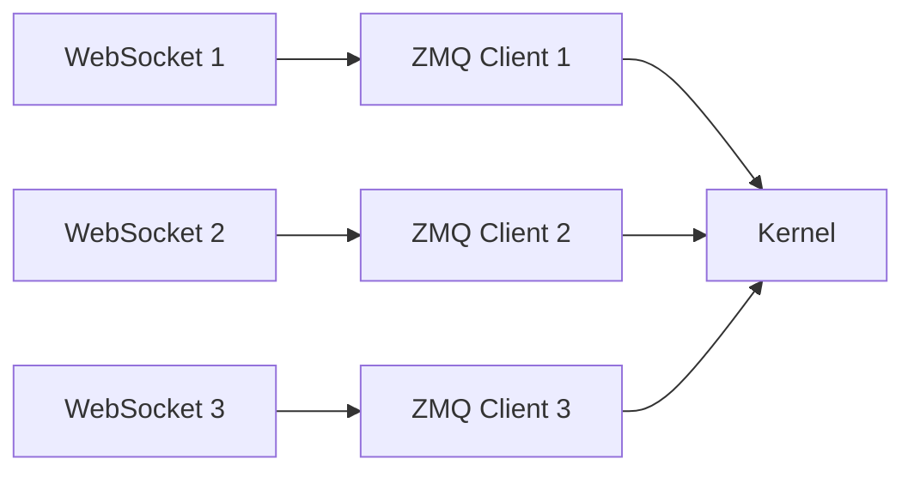
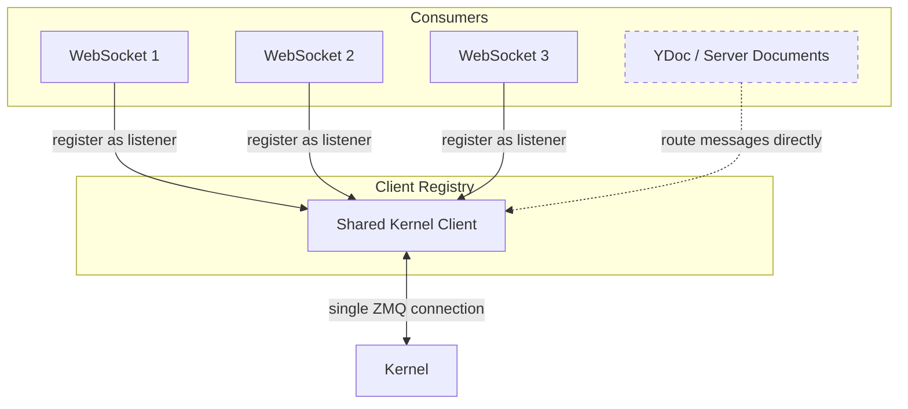
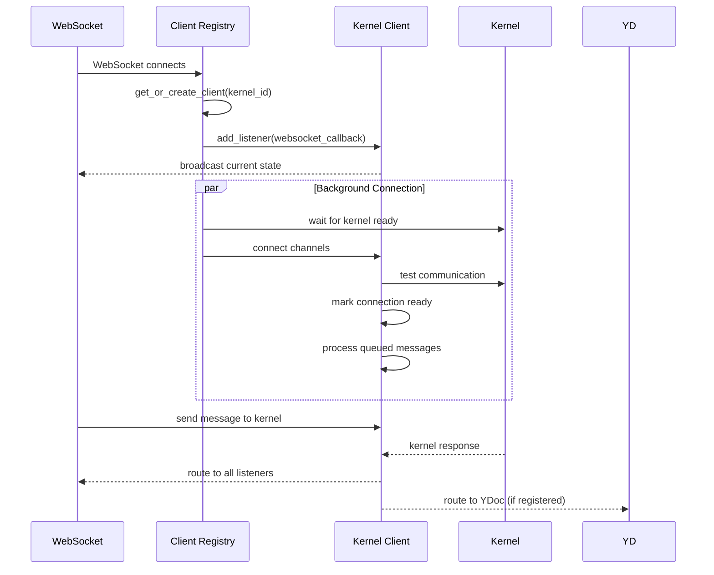

# nextgen-kernels-api

A next-generation Jupyter kernel client architecture that enables shared kernel connections and centralized message routing.

## Motivation

In the upstream Jupyter Server implementation, each WebSocket connection establishes its own set of ZMQ sockets to the kernel:



**Problems:**
- **Resource overhead**: Multiple redundant ZMQ connections per kernel
- **State fragmentation**: No centralized view of kernel execution state
- **Lost messages**: No way to route kernel messages to server-side consumers (YDocs, etc.)

## Architecture

This project introduces a **Client Registry** that manages a single shared kernel client per kernel:



### Client Lifecycle



### Key Design Principles

1. **Single Client per Kernel**: One shared ZMQ connection per kernel, used by all consumers
2. **Listener Pattern**: WebSockets and server-side components register as message listeners
3. **Centralized State**: Track execution state, activity, and lifecycle from one place
4. **Message Queuing**: Queue messages during startup, deliver when connection ready
5. **Server-Side Routing**: Enable direct message flow to YDocs for accurate state tracking

## Features

- **Shared Kernel Client**: Single ZMQ connection per kernel, shared across all consumers
- **Message Listener API**: Register callbacks to receive kernel messages from all channels
- **Connection Management**: Robust connect/disconnect/reconnect with health checks
- **State Tracking**: Monitor execution state (`idle`, `busy`, `starting`) via status messages
- **Message Queuing**: Queue messages during connection setup, deliver when ready
- **Message Cache**: Track outgoing requests and map responses to source channels

## Integration with Jupyter Server Documents

This architecture is designed to work seamlessly with [jupyter-server-documents](https://github.com/jupyter-ai-contrib/jupyter-server-documents), enabling server-side YDocs to receive kernel messages directly:

**Benefits:**
- **Accurate execution state**: YDoc always knows if kernel is busy/idle
- **No lost outputs**: Cell outputs flow directly to YDoc, even if no WebSocket connected
- **Real-time collaboration**: All clients (WebSockets + YDoc) see kernel state simultaneously

To integrate, simply register the YDoc as a listener on the shared kernel client:

```python
# In your YDoc initialization
client_registry = app.settings["client_registry"]
client = client_registry.get_client(kernel_id)
client.add_listener(ydoc.handle_kernel_message)
```

## Installation

```bash
pip install nextgen-kernels-api
```

Enable the extension:

```bash
jupyter server extension enable nextgen_kernels_api
```

This extension will automatically override the default Jupyter Server kernel APIs when the server starts.

## License

BSD-3-Clause
