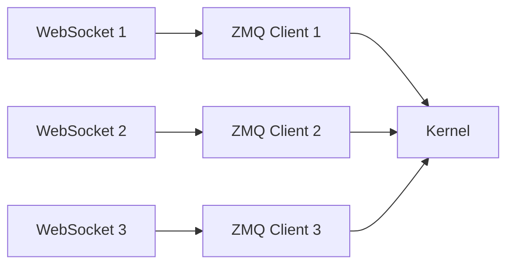
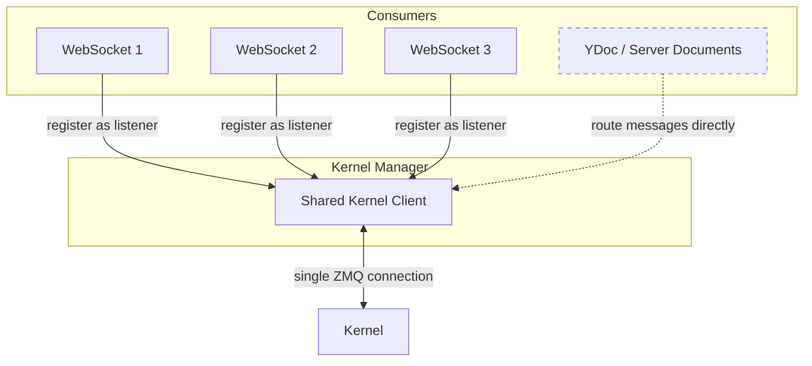
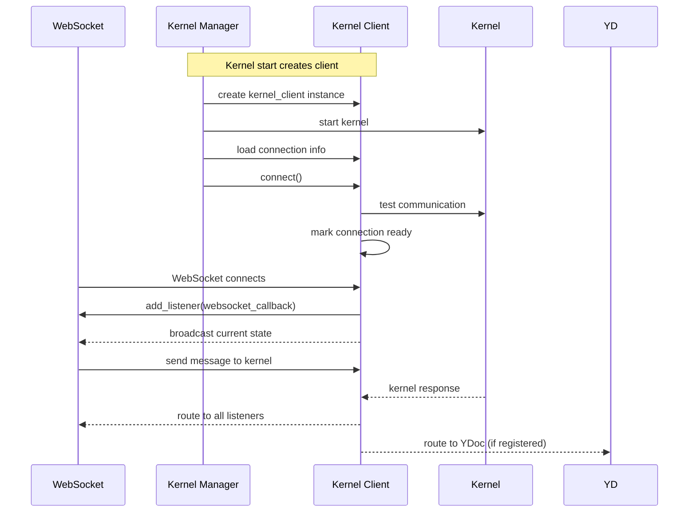
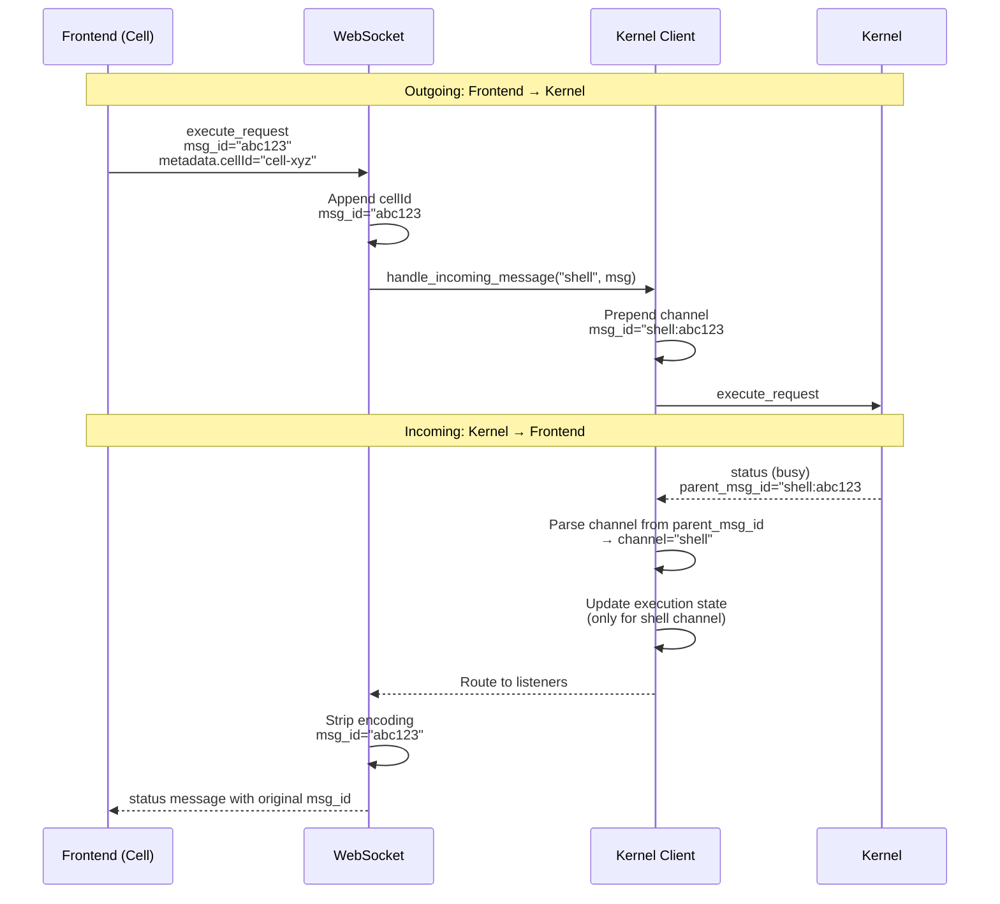

# nextgen-kernels-api

A next-generation Jupyter kernel client architecture that enables shared kernel connections and centralized message routing.

## Motivation

In the upstream Jupyter Server implementation, each WebSocket connection establishes its own set of ZMQ sockets to the kernel:



**Problems:**
- **Resource overhead**: Multiple redundant ZMQ connections per kernel
- **State fragmentation**: No centralized view of kernel execution state
- **Lost messages**: No way to route kernel messages to server-side consumers (YDocs, etc.)

## Architecture

This project introduces a **shared kernel client** managed by the kernel manager itself:



### Client Lifecycle



### Key Design Principles

1. **Single Client per Kernel**: One shared ZMQ connection per kernel, used by all consumers
2. **Listener Pattern**: WebSockets and server-side components register as message listeners
3. **Centralized State**: Track execution state, activity, and lifecycle from one place
4. **Message Queuing**: Queue messages during startup, deliver when connection ready
5. **Server-Side Routing**: Enable direct message flow to YDocs for accurate state tracking

## Features

- **Shared Kernel Client**: Single ZMQ connection per kernel, shared across all consumers
- **Message Listener API**: Register callbacks to receive kernel messages from all channels
- **Message Filtering**: Filter messages by type and channel when adding listeners (see [docs](docs/message_filtering.md))
- **Configurable WebSocket Filtering**: Configure message filtering for WebSocket connections via Jupyter Server config (see [docs](docs/websocket_filtering_config.md))
- **Connection Management**: Robust connect/disconnect/reconnect with health checks
- **State Tracking**: Monitor execution state (`idle`, `busy`, `starting`) via status messages
- **Message Queuing**: Queue messages during connection setup, deliver when ready
- **Message ID Encoding**: Track message origin (channel and cell ID) by encoding directly in message IDs

## Integration with Jupyter Server Documents

This architecture is designed to work seamlessly with [jupyter-server-documents](https://github.com/jupyter-ai-contrib/jupyter-server-documents), enabling server-side YDocs to receive kernel messages directly:

**Benefits:**
- **Accurate execution state**: YDoc always knows if kernel is busy/idle
- **No lost outputs**: Cell outputs flow directly to YDoc, even if no WebSocket connected
- **Real-time collaboration**: All clients (WebSockets + YDoc) see kernel state simultaneously

To integrate, simply register the YDoc as a listener on the kernel manager's client:

```python
# In your YDoc initialization or extension
# Get the multi-kernel manager from the server app
mkm = app.kernel_manager

# Get the specific kernel manager for your kernel
km = mkm.get_kernel(kernel_id)

# Access the shared kernel client
client = km.kernel_client

# Listen to all messages
client.add_listener(ydoc.handle_kernel_message)

# Or filter to only specific message types
client.add_listener(
    ydoc.handle_kernel_message,
    msg_types=[("execute_result", "iopub"), ("stream", "iopub")]
)
```

## Installation

```bash
pip install nextgen-kernels-api
```

Enable the extension:

```bash
jupyter server extension enable nextgen_kernels_api
```

This extension will automatically override the default Jupyter Server kernel APIs when the server starts.

## Configuration

To enable the shared kernel client architecture with message ID encoding, configure Jupyter Server to use the custom classes.

### Quick Start

Create a `jupyter_config.py` file in your Jupyter config directory (or use `--config=path/to/config.py`):

```python
c = get_config()

# Use the enhanced kernel manager with shared kernel clients
c.ServerApp.kernel_manager_class = "nextgen_kernels_api.services.kernels.kernelmanager.MultiKernelManager"

# Configure which KernelManager class each kernel uses
c.MultiKernelManager.kernel_manager_class = "nextgen_kernels_api.services.kernels.kernelmanager.KernelManager"

# Configure which client class the KernelManager uses
c.KernelManager.client_class = "nextgen_kernels_api.services.kernels.client.JupyterServerKernelClient"

# Configure the WebSocket connection class
c.ServerApp.kernel_websocket_connection_class = "nextgen_kernels_api.services.kernels.connection.kernel_client_connection.KernelClientWebsocketConnection"
```

Then start Jupyter Server:

```bash
jupyter server --config=jupyter_config.py
```

### What Gets Configured

1. **`MultiKernelManager`**: Manages all kernel instances
2. **`KernelManager`**: Creates and manages individual kernels with pre-created shared clients
3. **`JupyterServerKernelClient`**: Shared kernel client with:
   - Custom channel classes (`ShellChannel`, `ControlChannel`, `StdinChannel`) that auto-encode channel names
   - Listener API for multiple consumers
   - Message queuing during startup
4. **`KernelClientWebsocketConnection`**: WebSocket handler that:
   - Registers as a listener on the shared client
   - Encodes cell IDs in outgoing messages
   - Strips encoding from incoming messages

### Optional: Message Filtering

You can also configure message filtering for WebSocket connections:

```python
# Only send specific message types to WebSockets
c.KernelClientWebsocketConnection.msg_types = [
    ("execute_result", "iopub"),
    ("stream", "iopub"),
    ("error", "iopub"),
]

# Or exclude specific message types
c.KernelClientWebsocketConnection.exclude_msg_types = [
    ("status", "iopub"),
]
```

See the included `jupyter_config.minimal.py` for a complete minimal configuration example.

## Technical Details: Message ID Encoding

### The Problem

In a shared kernel client architecture, we need to track:
1. **Which channel** a message came from (shell vs control)
2. **Which cell** originated a request (for routing responses back)

Originally, an approach I took was to have a separate message cache to store this metadata, but this leads to unbounded memory growth.

### The Solution: Encode Metadata in Message IDs

Instead of maintaining a separate cache, we encode routing information directly into the message ID itself:

**Format:** `{channel}:{base_msg_id}#{cell_id}`

**Examples:**
- `shell:a1b2c3d4_12345_0#cell-abc123` - Execute request from a cell
- `control:a1b2c3d4_12345_1` - Interrupt request (no cell)
- `a1b2c3d4_12345_2` - Legacy format (backward compatible)

### Message Flow



### Encoding Points

**1. WebSocket Layer** (`kernel_client_connection.py`):
- **Incoming**: Appends `#cell_id` from metadata to msg_id
- **Outgoing**: Strips both channel and cell_id encoding before sending to frontend

**2. Kernel Client Layer** (`client.py`):
- **Outgoing**: Custom channel classes (`ShellChannel`, `ControlChannel`, `StdinChannel`) automatically prepend channel name to all messages
- **Incoming**: Parses channel from parent_msg_id in status messages for state tracking


## License

BSD-3-Clause

